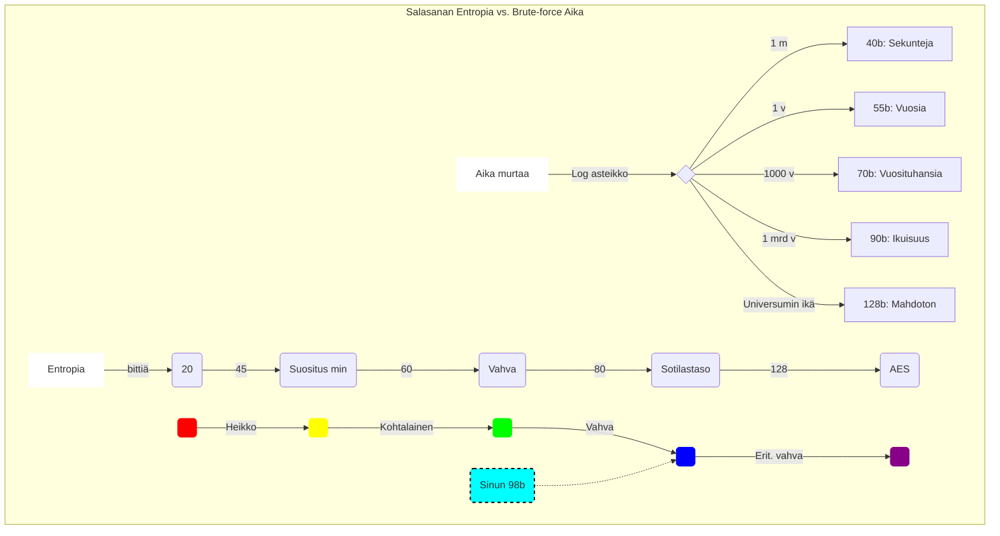

# Sedan-sihtaus: Salalausegeneraattori

Tämä on Python-pohjainen työkalu vahvojen, suomenkielisten salalauseiden generointiin. Ohjelma hyödyntää Kotuksen nykysuomen sanalistaa ja laskee jokaiselle lauseelle teoreettisen entropian (bitit).

## Ominaisuudet
* **Dynaaminen sanasto**: Lataa sanalistan suoraan Kotuksen palvelimelta ja suodattaa sanat pituuden mukaan.
* **Entropialaskenta**: Arvioi salasanan vahvuuden (Heikko -> Erit. vahva).
* **Leikepöytätuki**: Kopioi valitun salalauseen automaattisesti (`pyperclip`).
* **Dynaaminen muotoilu**: Tulostaa 15 vaihtoehdon listan siistissä taulukossa.

## Käyttöönotto (uv)

Ohjelma on optimoitu käytettäväksi [uv](https://github.com/astral-sh/uv)-työkalulla.

### Ajo komennolla:
```bash
uv run salasanamoottori.py
```


