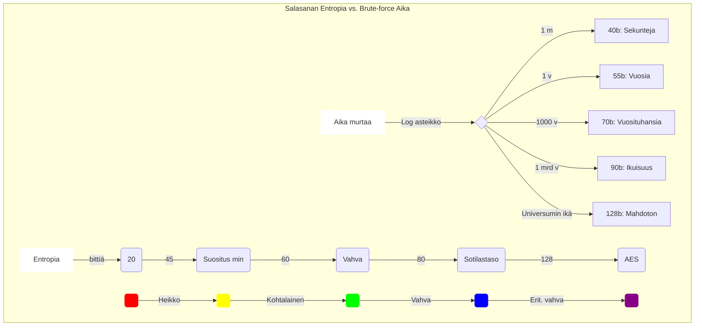

# 🔐 Sedan-sihtaus: Salalausegeneraattori

Tämä on Python-pohjainen työkalu vahvojen, suomenkielisten salalauseiden generointiin. Ohjelma hyödyntää Kotuksen nykysuomen sanalistaa ja tarjoaa matemaattisesti perustellun arvion salasanan murtovarmuudesta (entropia).

## 🌍 Selainversio
Sovellus on ajettavissa suoraan selaimessa (myös mobiilissa):
👉 **[salasanamoottori.streamlit.app](https://salasanamoottori.streamlit.app)**

---

## ✨ Ominaisuudet
* **Dynaaminen sanasto**: Hyödyntää Kotuksen nykysuomen sanalistaa (sisältää n. 94 000 sanaa).
* **Tunniste-tila (🗣️)**: Generoi foneettisesti selkeitä ja lyhyitä sanoja (2–5 kpl), jotka on helppo sanoa ääneen.
* **Vaikeusasteen hienosäätö**: Suodata sanoja kirjoitus- ja ääntämisvaikeuden perusteella (0–100).
* **Entropialaskenta**: Laskee teoreettisen bitin määrän (esim. 128 bittiä vastaa AES-standardin perustasoa).
* **Moderni teknologia**: Selainversio toteutettu Streamlitillä, CLI-versio optimoitu `uv`-työkalulle.
* **Sananmuunnokset**: Ensimmäinen kehitysversio sananmuunnoskoneesta, molempien sanojen tulee löytyä Kotus-sanastosta. 
---

## 📊 Mitä bitit tarkoittavat käytännössä?

Entropia kuvaa sitä, kuinka monta kertaa hyökkääjän on keskimäärin kokeiltava eri vaihtoehtoja ennen kuin salasana murtuu.

| Entropia (bittiä) | Vastaa suunnilleen... | Turvataso (Offline-hyökkäys) |
| :--- | :--- | :--- |
| **~20–30 b** | 5 satunnaista merkkiä tai 1 yleinen sana | **Heikko:** Murtuu sekunneissa millä tahansa laitteella. |
| **~45 b** | 8 merkkiä (pieniä/isoja/numeroita) | **Rajatapaus:** Murtuu tunneissa tehokkaalla näytönohjaimella. |
| **~60 b** | **4 suomenkielistä sanaa** | **Vahva:** Vaatii jo huomattavaa laskentatehoa ja aikaa. |
| **~80 b** | **5–6 suomenkielistä sanaa** | **Sotilastaso:** Murtaminen on käytännössä mahdotonta ilman supertietokonetta. |
| **128 b+** | **8–10 suomenkielistä sanaa** | **AES-taso:** Matemaattisesti murtamaton universumin eliniän aikana. |


---

## 🛠️ Paikallinen käyttö (CLI)

Ohjelma on optimoitu käytettäväksi [uv](https://github.com/astral-sh/uv)-työkalulla.

### Ajo komennolla:
```bash
uv run salasanamoottori.py
```


